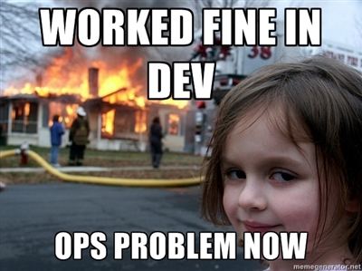
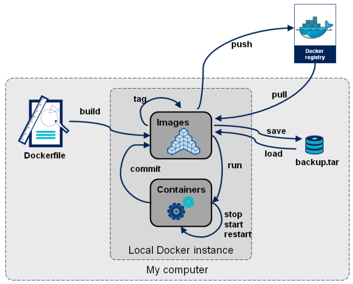
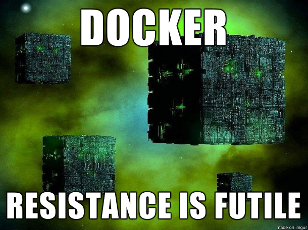

class: center, middle

# What is Docker?

---

## Forget Docker, what's a container?

A lightweight way to isolate an application or service from the rest of your
system; solves "build once, run anywhere" (where "anywhere" means atop an OS
which has the necessary capabilities).

--

Running the same image in dev, QA, and production means no more of this:

.center[]

---

## Forget Docker, what's a container?

Think `chroot` on steroids. Can get many of the benefits of a VM with a smaller
footprint.

Processes running in a container:
- Share the host's kernel.
- Have their own filesystem.
- May have their own resource limits, networking policies, etc.
- Can't break your host system (unless you're doing something crazy).

--

Docker isn't the only way to build and run containers (but it is definitely the
most trendy). Other containerization technologies include:
- [rkt](https://coreos.com/rkt/)
- [LXD](http://www.ubuntu.com/cloud/lxd)
- [OpenVZ](https://openvz.org/Main_Page)
- [systemd-nspawn](https://www.freedesktop.org/software/systemd/man/systemd-nspawn.html)

[FreeBSD jails](https://www.freebsd.org/doc/handbook/jails.html) and [Solaris
zones](https://docs.oracle.com/cd/E18440_01/doc.111/e18415/chapter_zones.htm)
are also similar.

???

Don't spend much time talking about alternatives. This is just to show they
exist and that Docker isn't technically unique.

---

## Docker is an ecosystem, not a particular application or protocol

There are a zillion different pieces of "Docker", many of which you may never
use.

Some components in the Docker ecosystem (non-exhaustive list):
- Docker Engine
  - [api](https://github.com/docker/engine-api)
  - [builder](https://github.com/docker/docker/tree/master/builder)
  - [containerd](https://containerd.tools/)
     - [runC](https://runc.io/) (the Docker runtime)
  - CLI
- [registries](https://github.com/docker/distribution) (including
  [Docker Hub](https://hub.docker.com/))
- [Docker Compose](https://docs.docker.com/compose/overview/)
- [Docker Swarm](https://docs.docker.com/swarm/overview/)

???

Don't need to spend a lot of time on this slide unless people have questions.

---

## Docker facts

- **Containers are ephemeral.** Persistent data is stored externally on mounted
  volumes.
- **Docker images are layered.** Each layer represents a read-only filesystem
  delta (kind of like a git commit).
  - Layers are cached and shared between builds.
- **Docker engine has a client/server architecture.** You can configure the CLI
  to talk to any host.

---

## Build phase: the Dockerfile

Dockerfiles are source code used to generate images with `docker build`.

There is a set of [predefined
commands](https://docs.docker.com/engine/reference/builder/), each of which
create new intermediate layers.

Most Dockerfiles start with `FROM` and end with `CMD` and/or `ENTRYPOINT`.
- `FROM` specifies the base image to start from (which itself may have been
  created with a Dockerfile).
- `ENTRYPOINT` and `CMD` are used to set the command that is executed at
  runtime.
  - There is some nuance here which is beyond the scope of this presentation.
    Read the docs to learn about the difference between `ENTRYPOINT` and `CMD`.

???

Show an example Dockerfile here.

---

## Run phase: how an image becomes a container

When you run an image, Docker creates a thin/writable/disposable "container
layer" atop the image stack and executes a given command.

`docker run` a few options you'll use frequently:
- `--tty` and `--interactive`
  - Allocate a pseudo-TTY and read from STDIN.
  - If your container has an interactive command you'll want these.
- `--volume`
  - Mount one or more directories into the container's filesystem.
  - This is what allows you to get files in/out of a container at runtime.
- `--publish`
  - Map network ports from inside the container to the host.

You can override the command that was set in the Dockerfile by passing your own
command to `docker run`. This can be handy while debugging, e.g. to get a shell
inside the container.

---

class: center, middle

## Demo time!

???

```
FROM alpine:3.3
RUN date > /now
CMD cat /now
```

1. Put the above into a Dockerfile.
  - Talk about each command and what it does.
  - Maybe brief aside about alpine linux.
1. `docker build .`
  - Talk about the output.
1. `docker run $image_id`
  - Mention that you can also tag images with names to make them easier to use.
1. Add a new layer after the `date` command. `COPY` would be good to show how
  that works:
  - `echo "blah" > foo`
  - Add `COPY foo bar`
1. `docker images`
  - Note that the new image has a different ID.
1. `docker run $new_image_id`
  - Talk about how the same date is shown.
1. `docker history $new_image_id`
  - Talk about the output.
1. Add a new layer *before* the `date` command.
1. Build and run the new image, noting that the date is now different.
1. Show `docker history` again and compare it to the old one.
1. Show how to override commands from `docker run` and explore the innards of
  the container.
  - `docker run --tty --interactive $image_id /bin/sh`


---

## Optimizing Dockerfiles

Some tips to speed up builds:

- Use fewer, smaller layers.
  - Combine layers where possible.
  - Think about how each layer changes the filesystem; keep the delta small.
- Clean up after yourself in `RUN` layers (remove temporary files, etc).
  - Do this in the same `RUN`. Having a separate `RUN` to remove files won't
    make your image any smaller. Each additional Dockerfile instruction will
    only ever increase the size of your image.
- Use a .dockerignore file to reduce the build context.
- Sort Dockerfile instructions by how cacheable they are.
  - Changing a layer will invalidate the cache for all layers that come after
    it.
  - For example if you expect to change file A often while file B is fairly
    fixed, then `COPY` A after B in the Dockerfile.
- `docker history` is handy.

---

## Publishing images: Docker registries

So you've built an image, but chances are you will want to share it with other
people/machines.

This is where registries come in. They're repositories for Docker images.

[Docker Hub](https://hub.docker.com/) is the official registry, but there are
plenty of others and you can host your own.

`docker pull` and `docker push` (plus a few other subcommands) provide a CLI
interface.

`FROM` will automatically pull images from the currently-configured registry if
they don't already exist in your cache.

---

class: center



---

## Docker Machine

Remember that part at the beginning when I said this?

> "anywhere" means atop an OS which has the necessary capabilities

Well, neither OSX nor Windows are one of those operating systems.

The solution is [docker-machine](https://docs.docker.com/machine/overview/),
which is a tool to set up and manage a Linux VM to run a Docker server.

Folks at docker are working on [a lighter-weight and more integrated
approach](https://blog.docker.com/2016/03/docker-for-mac-windows-beta/).

---

## Resources

- https://www.digitalocean.com/community/tutorials/the-docker-ecosystem-an-introduction-to-common-components
- https://github.com/docker/docker/blob/master/ROADMAP.md
- https://github.com/veggiemonk/awesome-docker
- http://www.jayway.com/2015/03/21/a-not-very-short-introduction-to-docker/
- https://docs.docker.com/engine/reference/builder/
- https://docs.docker.com/engine/userguide/eng-image/dockerfile_best-practices/

---

class: middle, center


